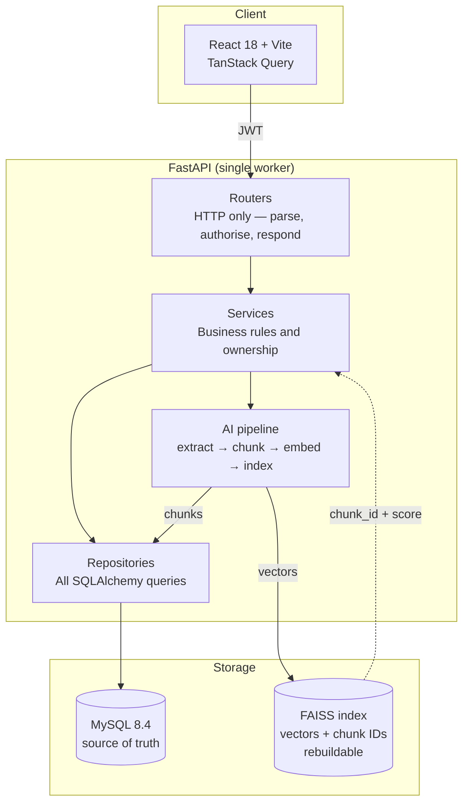
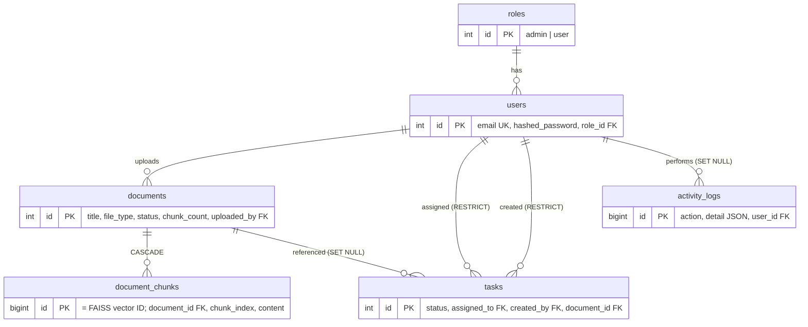

# AI-Powered Task & Knowledge Management System

An admin builds a knowledge base by uploading documents and assigns tasks; users find answers
with semantic search and complete their work. Search is **embedding-based and runs locally** —
no LLM API, no API key, nothing to pay for.

The interesting parts of this submission are the decisions, not the endpoints. Where a number
appears below (chunk size, similarity floor), it was **measured**, and the script that measured
it is in the repo.

---

## Table of contents

- [Screenshots](#screenshots)
- [Tech stack](#tech-stack)
- [Setup](#setup)
- [Architecture](#architecture)
- [Database design](#database-design)
- [How semantic search works](#how-semantic-search-works)
- [API](#api)
- [Testing](#testing)
- [Design decisions and trade-offs](#design-decisions-and-trade-offs)
- [Known limitations](#known-limitations)
- [Out of scope](#out-of-scope-and-what-id-do-next)

---

## Screenshots

**Semantic search — the whole point of the system.** The query shares *zero content words* with
the text that answers it. No keyword search (`LIKE`, TF-IDF, BM25) can connect "claim money
back" to "reimbursement within 30 days". Note that the highlighter only marks "money" and
"after" — the actual answer isn't highlighted, which is precisely the point: the match is
semantic, not lexical.


**Analytics** — every number is derived from live tables and the activity log. "Most searched
queries" is a MySQL JSON-path aggregation over `activity_logs.detail`, not a hardcoded list.


**Tasks with dynamic filtering** — the filter bar drives real server-side query params
(`GET /api/v1/tasks?status=completed`), verified in the network tab, not client-side filtering.


**Documents** — upload, chunk count, and index status.


**Login**


---

## Tech stack

| Layer | Choice | Why |
|---|---|---|
| Backend | **Python 3.12 + FastAPI** | Required. 3.12 over the machine's 3.14 — see [ADR-004](#adr-004--python-312-not-314) |
| Frontend | **React 18 + Vite** | Required |
| Database | **MySQL 8.4** (Docker) | Required. Pinned image, `utf8mb4` |
| ORM / migrations | **SQLAlchemy 2 + Alembic** | Real migrations, not `create_all()` — the schema has a history |
| Auth | **PyJWT + pwdlib[bcrypt]** | Not `python-jose`/`passlib` — see [ADR-006](#adr-006--pyjwt--pwdlib-not-python-jose--passlib) |
| Embeddings | **sentence-transformers `all-MiniLM-L6-v2`** | Local, 384-dim, no API key — see [ADR-001](#adr-001--local-embeddings-not-an-embedding-api) |
| Vector index | **FAISS** `IndexFlatIP` + `IndexIDMap2` | Exact cosine search — see [ADR-002](#adr-002--faiss-indexflatip--indexidmap2-mysql-as-source-of-truth) |
| PDF extraction | **pypdf** | Text-based PDFs; OCR out of scope |
| Server state | **TanStack Query** | No Redux — see [ADR-005](#adr-005--tanstack-query-no-redux) |
| Containers | **Docker Compose** | Whole stack in one command; CPU-only torch, model baked at build |

---

## Setup

### Option A — Docker (everything, one command)

**Prerequisites:** Docker Desktop running.

```bash
docker compose up -d --build
```

That's it. Compose builds both images, waits for MySQL to be healthy, then the backend entrypoint
applies migrations, seeds accounts, and rebuilds the vector index if it has drifted — before
uvicorn starts.

- Frontend → http://localhost:5173
- API docs → http://localhost:8000/docs
- Health → http://localhost:8000/health

First build takes ~5 minutes: it installs CPU-only PyTorch and **bakes the embedding model into
the image**, so containers start offline with no runtime download.

```bash
docker compose logs -f backend    # watch startup and live search logs
docker compose down               # stop
docker compose down -v            # stop and wipe all data
```

Then jump to [step 4](#4-log-in).

### Option B — Local development

**Prerequisites:** Python 3.12, Node 18+, Docker Desktop **running** (for MySQL), Git.

> **Python 3.12 may ship without pip.** That is expected and handled: `python -m venv` bootstraps
> pip via `ensurepip`. Always work inside the venv — never call `py -3.12 -m pip` directly.

### 1. Database

```bash
docker compose up -d          # MySQL 8.4 on :3306, throwaway test DB on :3307
```

### 2. Backend

```bash
cd backend
py -3.12 -m venv .venv                  # Windows
# python3.12 -m venv .venv              # macOS/Linux

.venv\Scripts\Activate.ps1              # Windows PowerShell
# source .venv/bin/activate             # macOS/Linux

python -m pip install -U pip
python -m pip install -r requirements.txt   # torch is ~200MB, allow a few minutes

copy .env.example .env                  # cp on macOS/Linux
# then set JWT_SECRET_KEY:
python -c "import secrets; print(secrets.token_urlsafe(32))"

alembic upgrade head
python -m scripts.seed

# Optional — sample_docs/onboarding_guide.pdf is already committed.
# Run only to regenerate it: python -m scripts.make_sample_pdf

python -m uvicorn app.main:app --reload --port 8000 --workers 1
```

> **`--workers 1` is not a suggestion.** The app refuses to boot with more. See
> [ADR-007](#adr-007--single-worker-serving).

> **First start downloads the embedding model (~80MB)** from HuggingFace. It is loaded once at
> startup rather than on first request, so a cold start takes a few extra seconds instead of the
> first search appearing to hang.

Docs at http://localhost:8000/docs · health at http://localhost:8000/health

### 3. Frontend

```bash
cd frontend
npm install
npm run dev                   # http://localhost:5173
```

### 4. Log in

Open **http://localhost:5173**

| Role | Email | Password |
|---|---|---|
| Admin | `admin@example.com` | `Admin@123` |
| User | `alice@example.com` | `User@123` |
| User | `bob@example.com` | `User@123` |

### 5. See the demo that matters

Log in as **admin** → Documents → upload all three files from `sample_docs/`. Then go to
**Search** and ask:

> *how long do I have to claim money back after buying something?*

The top hit is "Employees may request reimbursement within 30 days of purchase" at **0.478**.
The query and the answer share **no content words**.

Then try a control query — *"how do I book the tennis court?"* — and get **nothing back**,
which matters just as much. See [How semantic search works](#how-semantic-search-works).

---

## Architecture

Strict one-way dependency: **router → service → repository → model**.



- **Router** — HTTP only. Parse, check role, call a service, shape a response. No queries, no rules.
- **Service** — business rules. "Only the assignee or an admin may change status." "Chunk and embed on upload."
- **Repository** — all database access. Services never build queries inline.
- **Models / schemas** — SQLAlchemy ORM kept separate from Pydantic request/response models.

```
backend/app/
  core/         config, security, deps (get_current_user, require_role), exceptions
  db/           engine, session, declarative base
  models/       roles, users, documents, document_chunks, tasks, activity_logs
  schemas/      pydantic in/out
  repositories/ user_repo, task_repo, document_repo
  services/     auth, task, document, search, analytics, activity
    ai/         extractor, chunker, embedder, vector_store
  routers/      auth, users, tasks, documents, search, analytics
backend/scripts/  seed, reindex, calibrate, sweep_chunking, make_sample_pdf
```

---

## Database design



Normalized to 3NF. Every relation is a real foreign key with a deliberate delete rule:

| Relation | Rule | Reasoning |
|---|---|---|
| `document_chunks` → `documents` | **CASCADE** | Chunks are meaningless without their document |
| `tasks` → `users` | **RESTRICT** | Deleting a user must never silently orphan task history |
| `activity_logs` → `users` | **SET NULL** | The audit trail must outlive the user it describes |
| `users` → `roles` | **RESTRICT** | A role can't vanish while users reference it |

That asymmetry between `tasks` (RESTRICT) and `activity_logs` (SET NULL) is intentional: task
records need an owner to make sense; audit records need to survive regardless.

**`tasks` carries two foreign keys to `users`** (`assigned_to`, `created_by`). SQLAlchemy cannot
infer which relationship follows which column and raises `AmbiguousForeignKeysError` unless both
sides declare `foreign_keys=` explicitly.

Verified against the live database:

```
tasks_ibfk_1  assigned_to  → users.id     document_chunks → documents  CASCADE
tasks_ibfk_2  created_by   → users.id     tasks           → users      RESTRICT
tasks_ibfk_3  document_id  → documents.id activity_logs   → users      SET NULL
```

**Indexes** are placed where the API actually reads: `(assigned_to, status)` on `tasks` backs
the filtering endpoint; `(action, created_at)` on `activity_logs` backs the analytics
aggregations.

---

## How semantic search works

```
upload → extract (pypdf / utf-8) → chunk (400 chars, 50 overlap)
       → embed (MiniLM, L2-normalized) → MySQL commit → FAISS add → status=indexed

query  → embed → FAISS inner product (= cosine) → drop below floor
       → hydrate chunks from MySQL → ranked results
```

**Vectors are L2-normalized**, so FAISS's inner product *is* cosine similarity — every score is
a cosine in `[-1, 1]`, comparable across queries.

**FAISS stores real `document_chunks.id` values** via `IndexIDMap2`, so a hit maps straight back
to MySQL with no side-car mapping file to drift out of sync.

**Write order is load-bearing:** MySQL commits *before* the index is written, and the document is
only marked `indexed` once both succeed. If the index write fails, the document stays `pending`
and `scripts/reindex.py` repairs it. The reverse order would leave vectors pointing at rows that
were never committed — searches returning hits that can't be hydrated. A silent wrong answer is
the worst failure available to a search system.

### The numbers were measured, not guessed

An earlier draft of this system asserted a similarity floor of `0.25` and a pass mark of `0.4`.
Both were invented. Calibration proved they were wrong, and the process is worth reading:

**Round 1 — the fixture failed.** `scripts/calibrate.py` reported a **negative separation gap**:
some genuine answers scored *below* some noise. Shipping the invented constants would have
produced a system that looked fine and wasn't.

**Round 2 — the obvious hypothesis was also wrong.** At 500 characters, a chunk spanned several
policy sections, so its embedding averaged several topics and represented none. Plausible. But
`scripts/sweep_chunking.py` swept 150–500 and the gap stayed negative at *every* size. Chunking
wasn't the cause.

**Round 3 — the real cause.** One "control" query was `"what is the parental leave allowance?"`
against a corpus covering *annual* leave. It scored **0.47** — higher than several true answers.
That isn't a bug. Cosine similarity measures **topical relatedness, not factual answerability**.
The query really is about leave; the corpus really does discuss leave; it just lacks *parental*
leave. The fixture had been conflating two different things:

- **True negatives** — off-topic entirely ("how do I book the tennis court?"). A floor excludes these.
- **Near-misses** — right topic, absent fact. **No floor can exclude these**, because they land in
  the same score band as real answers by design.

**Result** (`sample_docs/calibration_result.md`), at chunk size **400/50**, the only config that
ranked all 7 paraphrase queries correctly:

| Metric | Value |
|---|---|
| Lowest paraphrase score (weakest true positive) | **0.2971** |
| Highest control score (strongest true negative) | **0.2365** |
| **Separation gap** | **+0.0606** |
| `SIMILARITY_FLOOR` (midpoint) | **0.2668** |
| Highest near-miss score (not gated) | **0.4284** |

All 7 paraphrases rank #1 through the live API:

| Query (zero shared content words) | Retrieves | Score |
|---|---|---|
| how long do I have to claim money back after buying something? | "within 30 days of purchase" | 0.478 |
| can I sleep somewhere expensive when I travel for work? | "180 GBP per night in London" | 0.461 |
| how many characters should my login secret be? | "at least twelve characters" | 0.533 |
| what happens if my laptop gets taken? | "Lost or stolen devices" | 0.501 |
| how many days off do new joiners get each year? | "25 days of paid annual leave" | 0.402 |
| how long until I am a permanent member of staff? | "probation period of six months" | 0.477 |
| am I allowed to do my job from home? | "work remotely up to three days" | 0.297 |

Reproduce: `python -m scripts.calibrate`

---

## API

Base: `/api/v1`. Errors: `{"detail": "..."}`.

| Method | Path | Role | Notes |
|---|---|---|---|
| POST | `/auth/login` | public | → `{access_token, user}`; logs `login` |
| GET | `/auth/me` | any | Current user |
| GET | `/users` | **admin** | Assignee picker. Admin-gated: a user roster is what credential stuffing wants |
| POST | `/documents` | **admin** | Multipart; extract → chunk → embed → index; logs `document_upload` |
| GET | `/documents` | any | Filters: `?file_type=&status=&uploaded_by=` |
| DELETE | `/documents/{id}` | **admin** | Cascades chunks **and** removes vectors |
| POST | `/tasks` | **admin** | Create and assign |
| GET | `/tasks` | any | **Dynamic filtering** — see below |
| PATCH | `/tasks/{id}/status` | assignee or admin | `pending` ↔ `completed`; logs `task_update` |
| POST | `/search` | any | Semantic search; logs `search` |
| GET | `/analytics` | **admin** | Live counts + top queries |
| GET | `/health` | public | Includes the index-consistency invariant |

### Dynamic filtering

`GET /tasks?status=completed&assigned_to=1&limit=50&offset=0` — every param optional, all compose.

One composable builder in `task_repo.list_filtered`; each supplied filter narrows the statement,
absent ones are skipped. Adding a filter is one branch, never a new permutation and never an
f-string:

```python
stmt = select(Task)
if filters.status is not None:
    stmt = stmt.where(Task.status == filters.status)
if filters.assigned_to is not None:
    stmt = stmt.where(Task.assigned_to == filters.assigned_to)
...
```

**Non-admins are scoped in the service, above the repository.** A user passing
`?assigned_to=<someone_else>` silently gets their own tasks — not a 403, because the request is
legitimate; its scope simply isn't theirs to choose.

---

## Testing

```bash
cd backend && .venv\Scripts\Activate.ps1
pytest -v
```

Tests run against the **throwaway MySQL on :3307**, never SQLite. SQLite can't parse
`detail->>'$.query'`, doesn't enforce `ENUM`, and has foreign keys off by default — so the
analytics, cascade, and JSON tests would pass locally while proving nothing about the real
database.

Verified end-to-end against the running API (`GET /health` reports `index_consistent`):

- Wrong password → 401; **unknown email returns a byte-identical 401** (no user enumeration)
- Non-admin → 403 on upload, create-task, `/users`, `/analytics`
- Alice with `?assigned_to=<bob>` → only her own tasks
- Alice reading or patching Bob's task → **404, not 403**
- All 7 paraphrases rank #1; all 4 true-negative controls return `[]`
- Delete removed **exactly** the document's `chunk_count` vectors, and the content stopped being searchable
- Empty file and wrong extension → 422
- All four mandated actions present in `activity_logs`

---

## Design decisions and trade-offs

### ADR-001 — Local embeddings, not an embedding API

`all-MiniLM-L6-v2` on CPU. The brief says *"Do NOT rely only on LLM APIs. Core logic must be
implemented"* and grades "not over-relying on external APIs".

**Rejected:** OpenAI `text-embedding-3-small` — better quality and one line of code, but it
concedes the exact competency being tested and hard-blocks any reviewer without an API key.
**Rejected:** TF-IDF/BM25 — not embeddings; fails the requirement and every paraphrase above.

**Cost:** ~80MB first-run download; weaker than a frontier model at a scale where it doesn't matter.

### ADR-002 — FAISS `IndexFlatIP` + `IndexIDMap2`, MySQL as source of truth

Exact brute-force inner product over normalized vectors. No training step, deterministic,
instant at this scale. `IndexIDMap2` stores real chunk IDs (it also adds a reverse map for
efficient `reconstruct`; `IndexIDMap` supports `remove_ids` too — the difference is
`reconstruct`, not removal).

**Rejected:** `IndexIVFFlat` — faster at scale, but approximate and needs training; premature at
~19 vectors. Worth knowing the upgrade isn't free: `remove_ids` on an IDMap2-wrapped IVF index
is a [known FAISS issue](https://github.com/facebookresearch/faiss/issues/4535), so the delete
path would need rework alongside it.
**Rejected:** Chroma — less code, but hides the retrieval mechanics the brief wants implemented.

**Ceiling:** linear scan is fine to ~100k vectors. Beyond that, IVF plus the caveat above.

### ADR-003 — A `document_chunks` table beyond the brief's minimum five

The brief lists five minimum tables. This adds a sixth, deliberately.

One embedding per 20-page PDF averages away every specific fact and retrieves nothing useful —
chunk-level retrieval is the only design that produces a working demo. The chunk ID is also what
FAISS stores, which is what makes the index rebuildable from MySQL.

The brief says "**Minimum** tables" — a floor, not a ceiling.

**Rejected:** document-level embeddings — satisfies the list literally, ships a search feature
that visibly doesn't work. **Rejected:** chunks in a JSON column — unjoinable, unindexable,
contradicts the "relations, normalization" grading line.

### ADR-004 — Python 3.12, not 3.14

This machine defaults to 3.14. I originally assumed torch/faiss wheels lag new CPython minors
and wrote that down as the reason. **That was false** — I checked, and `pip install --dry-run
--python-version 314` resolves the identical set (`torch 2.13.0`, `faiss-cpu 1.14.3`).

The honest reason: **both work**, so this is a low-stakes call. 3.12 has years of ecosystem
battle-testing; 3.14 is recent and its JIT/free-threading work means less-trodden paths through
native extensions. On a tight clock with no rollback room, the boring runtime is worth more than
the new one. If 3.14 is preferred, it will work.

**Consequence:** 3.12 ships without pip. `venv` bootstraps it via `ensurepip` — hence venv-first
in setup.

### ADR-005 — TanStack Query, no Redux

Context for auth; TanStack Query for all server state.

**Rejected:** Redux Toolkit. A reviewer may expect it, so: global client state here is exactly
one auth object. Every server-state slice would become hand-rolled loading/error/cache logic —
ceremony read as competence. Cache invalidation on mutation is the actual hard part, and Query
solves it for free. **Rejected:** raw `useEffect` + `useState` — no caching or dedup, stale UI
after mutations, visible in the screenshots.

### ADR-006 — PyJWT + pwdlib, not python-jose + passlib

The conventional pairing for this stack is `passlib[bcrypt]` + `python-jose`. Both are wrong here:

- **`passlib` 1.7.4** (unmaintained since 2020) reads `bcrypt.__about__.__version__`, which
  bcrypt **removed in 4.1+**. With current bcrypt this is a guaranteed break, not a risk. Pinning
  `bcrypt<4.1` works — but shipping a 2022 crypto library in a submission graded partly on auth
  invites a question with no good answer.
- **`python-jose`** is effectively unmaintained with algorithm-confusion CVEs
  (CVE-2024-33663/33664), and pulls in `ecdsa`, which carries the unfixed Minerva timing
  vulnerability (CVE-2024-23342) that its maintainers declared out of scope.

**Result:** two fewer transitive dependencies and no known CVEs.

### ADR-007 — Single-worker serving

The FAISS index lives in process memory. Under N workers there are N divergent indexes: an
upload mutates worker A's copy, a search routed to worker B finds nothing, and every worker
races writes to the same index file. **Every response is still 200** — completely silent. The
`threading.Lock` in `vector_store` guards threads within one process and does nothing across
processes.

So the app **refuses to boot** with `WEB_CONCURRENCY > 1` rather than failing quietly.

**This is where the design stops scaling, and it's stated rather than discovered.** The real fix
is externalising the vector store (Chroma in server mode, Qdrant), which is a whole extra service
and out of scope for an MVP.

### Docker decisions worth naming

- **CPU-only PyTorch, installed from `download.pytorch.org/whl/cpu` before anything else.** On
  Linux, a plain `pip install torch` resolves to the CUDA build — roughly 2.5GB of nvidia
  libraries this app never touches, since inference runs on CPU. Verified: `torch 2.13.0+cpu`,
  zero nvidia packages in the image.
- **The embedding model is baked in at build time.** Otherwise the first container start pulls
  ~80MB from HuggingFace, which looks like a hang and fails outright on an offline machine.
- **The entrypoint self-heals.** It waits for MySQL, applies migrations, seeds, and — because the
  index is a volume while MySQL is the source of truth — rebuilds the index if the two have
  drifted. Deleting the index volume and restarting logs `DRIFT (-59)` and rebuilds all 59
  vectors before serving a single request.
- **`npm install`, not `npm ci`, in the frontend image.** Vite 8 uses rolldown, whose native
  bindings are platform-specific optional deps; a Windows-generated lock file cannot satisfy
  `npm ci`'s strict cross-platform check inside a Linux image (npm/cli#4828). The trade-off is
  slightly less reproducible builds, versus committing a Linux-only lock that breaks local dev.
- **`VITE_API_URL` is a build arg, not a runtime env var.** Vite inlines env vars into the bundle
  at build time. It points at `localhost:8000` because the **browser** resolves it, not the
  container — `http://backend:8000` would only work from inside the compose network.
- **Healthchecks use `127.0.0.1`, not `localhost`.** nginx binds `0.0.0.0` (IPv4), while
  `localhost` resolves to `[::1]` first inside the container — so a perfectly healthy container
  reports `Connection refused` forever.

### Security decisions worth naming

- **No user enumeration.** An unknown email verifies against a dummy hash before failing, so it
  costs the same as a wrong password and returns a byte-identical 401. Returning early would make
  response time an oracle for which emails are registered.
- **404, not 403, for other people's tasks.** A 403 confirms the row exists, letting an attacker
  map the table by probing IDs and reading status codes.
- **Defence in depth.** `require_role` gates the route; the service independently re-checks
  ownership. A role gate cannot answer "is this *your* task?".
- **`/users` is admin-only.** A full roster is exactly what credential stuffing wants.

---

## Known limitations

**Near-miss queries return confident, wrong-ish results.** Ask *"what is the parental leave
allowance?"* against a corpus covering annual leave and you get the annual-leave chunk at
**0.4284** — higher than every genuine answer above. This is not a tuning bug. Cosine similarity
scores **topical relatedness, not whether the answer is present**, so near-misses occupy the same
band as true hits by construction. Raising the floor to exclude them would reject real answers
first.

Fixing it properly needs a **cross-encoder reranker** or an **LLM answerability check** over the
retrieved chunk. Both are out of scope here, so it's measured and documented rather than hidden.

**The separation gap is narrow (+0.0606)** and tuned to this corpus. A different document set
should re-run `scripts/calibrate.py` rather than inherit `0.2668`.

**Other limits:** single worker (ADR-007) · no OCR, so scanned PDFs return 422 by design · no
refresh tokens (60-minute expiry, then log in again) · last-write-wins on concurrent task updates
· no duplicate-upload detection.

---

## Out of scope, and what I'd do next

Deliberately not built: password reset, email, refresh-token rotation, multi-tenancy, document
versioning, real-time updates, pagination beyond limit/offset, CI.

**In priority order, with the trigger for each:**

1. **Cross-encoder reranker** over the top-k — fixes the near-miss limitation above, the biggest
   real quality gap. *Trigger: first user complaint about a confidently wrong result.*
2. **Externalise the vector store** — removes the single-worker constraint. *Trigger: first need
   to scale out.*
3. **Sentry + structured log shipping** — today `activity_logs` and `/health`'s
   `index_consistent` flag are the observability layer, which is enough for an MVP and nothing
   more. *Trigger: first real deploy.*
4. **Refresh tokens.** *Trigger: first complaint about hourly re-login.*
5. **Background indexing** (Celery/queue) — upload is synchronous; a 200-page PDF would block.
   *Trigger: first upload over ~50 pages.*
