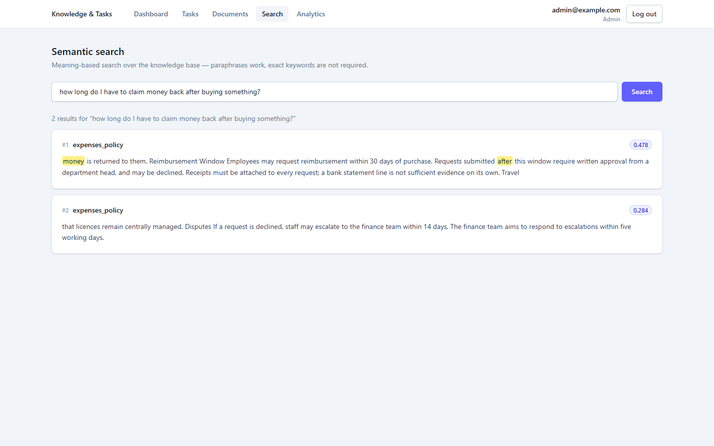
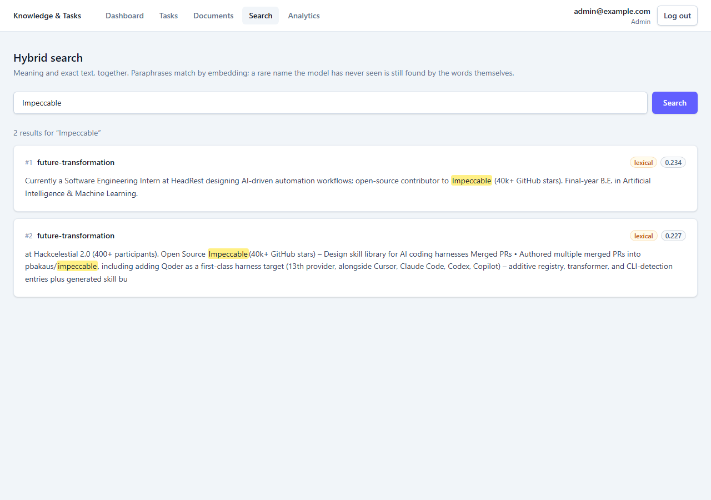
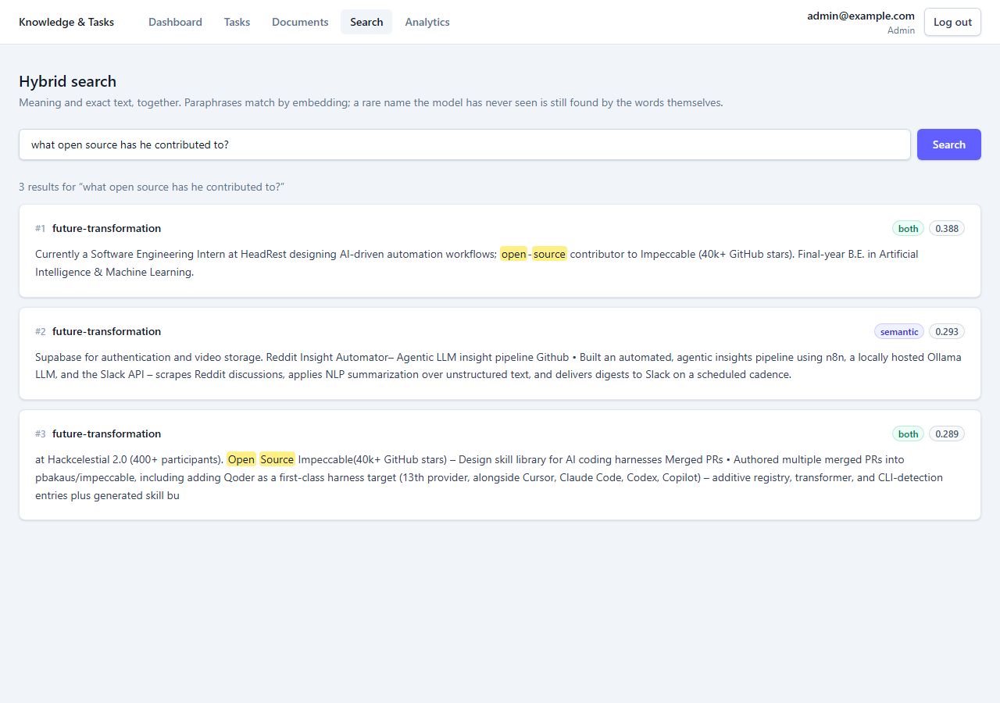
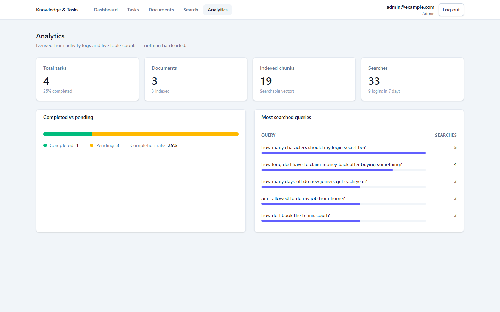
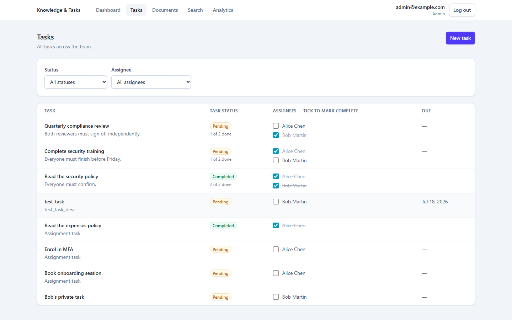
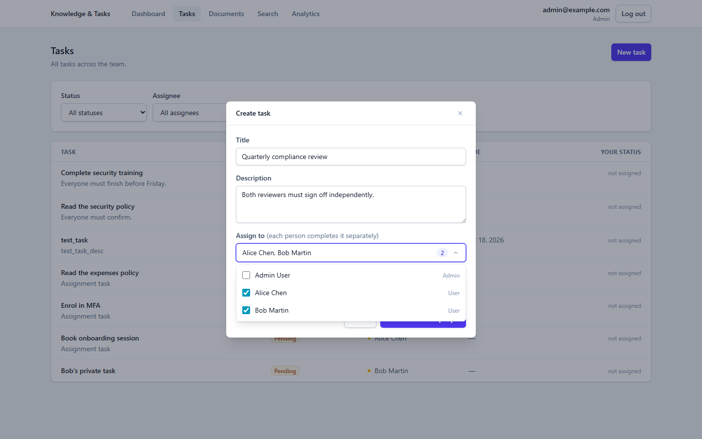
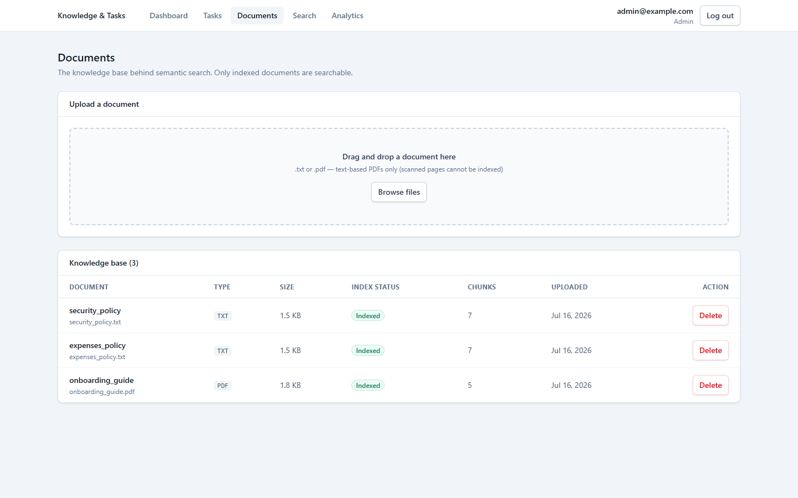
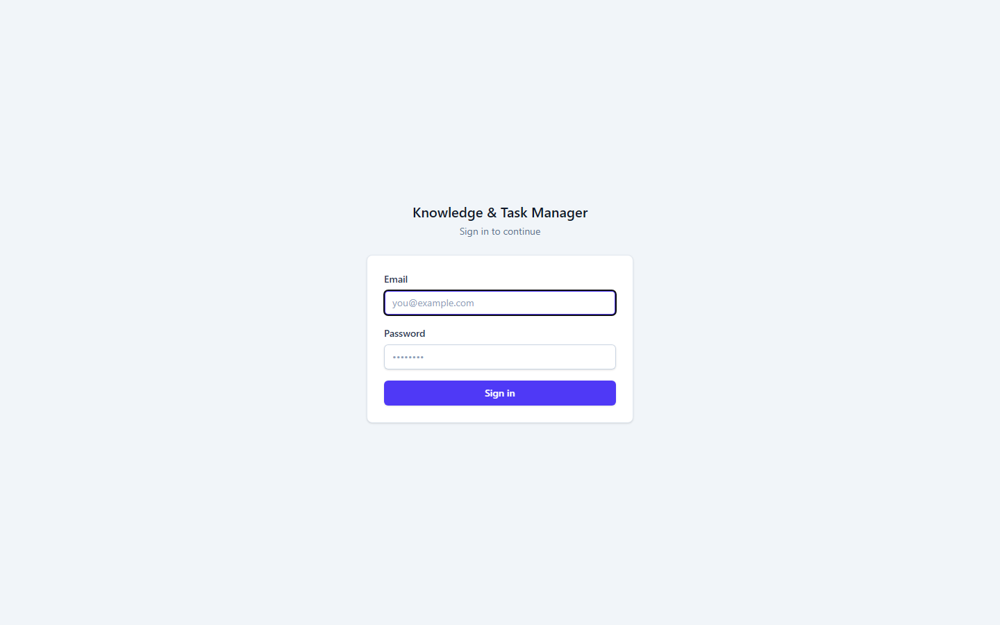
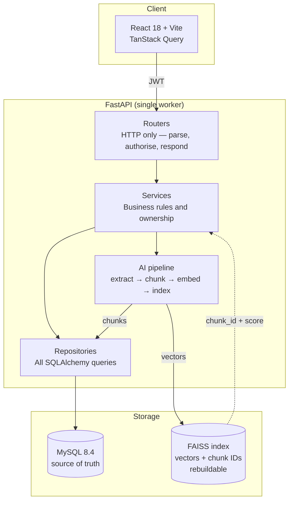
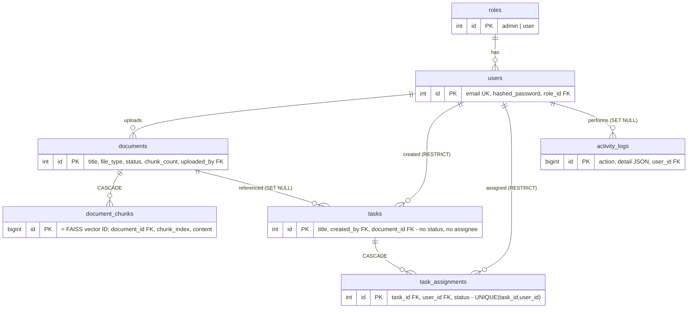

# AI-Powered Task & Knowledge Management System

An admin uploads documents and assigns tasks. Users search those documents with semantic
search and complete their work. The search is embedding-based and runs locally — no LLM API,
no API key, nothing to pay for.

Where a number shows up below (chunk size, similarity floor), it was measured, and the script
that measured it is in the repo.

---

## Table of contents

- [Screenshots](#screenshots)
- [Tech stack](#tech-stack)
- [Setup](#setup)
- [Architecture](#architecture)
- [Database design](#database-design)
- [How semantic search works](#how-semantic-search-works)
- [API](#api)
- [Testing](#testing)
- [Design decisions](#design-decisions)
- [Known limitations](#known-limitations)
- [What I'd do next](#what-id-do-next)

---

## Screenshots

Semantic search. The query shares no content words with the text that answers it, so no
keyword search could connect "claim money back" to "reimbursement within 30 days". The
highlighter only marks "money" and "after" — the actual answer isn't highlighted, which is
the point. The match is semantic, not lexical.



Hybrid retrieval, and the bug that forced it. `Impeccable` is a project name in an uploaded CV.
The embedding model has never seen it — it only knows the adjective — so the chunk scores 0.234
against a 0.268 floor and pure semantic search returned nothing at all. The lexical half finds
it on the literal string. The badge says how it matched and the score is the real cosine,
reported below the floor rather than dressed up. See
[ADR-009](#adr-009--hybrid-retrieval-semantic--lexical).



The other half, still working. This query shares no words with result #2 — nothing is
highlighted in it, because nothing lexical matched. It's there on meaning alone (`semantic`,
0.293). Results #1 and #3 matched both ways.



Analytics. Every number comes from live tables and the activity log. "Most searched queries"
is a MySQL JSON-path aggregation over `activity_logs.detail`, not a hardcoded list.



Tasks with filtering. The filter bar drives real server-side query params
(`GET /api/v1/tasks?status=completed`), not client-side filtering.



Assigning one task to several people. The dropdown opens to a checkbox per user. Each
assignee completes the task independently, so the row reads `Pending · 1 of 2 done` until
everyone is finished.



Documents — upload, chunk count, index status.



Login.



---

## Tech stack

| Layer | Choice | Why |
|---|---|---|
| Backend | Python 3.12 + FastAPI | Required. 3.12 over 3.14 — see [ADR-004](#adr-004--python-312-not-314) |
| Frontend | React 18 + Vite | Required |
| Database | MySQL 8.4 (Docker) | Required. Pinned image, `utf8mb4` |
| ORM / migrations | SQLAlchemy 2 + Alembic | Real migrations, not `create_all()` |
| Auth | PyJWT + pwdlib[bcrypt] | Not `python-jose`/`passlib` — see [ADR-006](#adr-006--pyjwt--pwdlib-not-python-jose--passlib) |
| Embeddings | sentence-transformers `all-MiniLM-L6-v2` | Local, 384-dim, no API key — see [ADR-001](#adr-001--local-embeddings-not-an-embedding-api) |
| Vector index | FAISS `IndexFlatIP` + `IndexIDMap2` | Exact cosine search — see [ADR-002](#adr-002--faiss-and-mysql-as-source-of-truth) |
| Lexical index | MySQL `FULLTEXT` | The other half of hybrid retrieval — see [ADR-009](#adr-009--hybrid-retrieval-semantic--lexical) |
| PDF extraction | pypdf | Text-based PDFs; OCR out of scope |
| Server state | TanStack Query | No Redux — see [ADR-005](#adr-005--tanstack-query-no-redux) |
| Containers | Docker Compose | Whole stack in one command |

---

## Setup

### Option A — Docker

You need Docker Desktop running.

```bash
docker compose up -d --build
```

That's it. Compose builds both images, waits for MySQL to be healthy, then the backend
entrypoint applies migrations, seeds accounts, and rebuilds the vector index if it has
drifted — all before uvicorn starts.

- Frontend → http://localhost:5173
- API docs → http://localhost:8000/docs
- Health → http://localhost:8000/health

The first build takes about 5 minutes. It installs CPU-only PyTorch and bakes the embedding
model into the image, so containers start offline with no runtime download.

```bash
docker compose logs -f backend    # watch startup and live search logs
docker compose down               # stop
docker compose down -v            # stop and wipe all data
```

Then skip to [step 4](#4-log-in).

### Option B — Local development

You need Python 3.12, Node 18+, Docker Desktop running (for MySQL), and Git.

Note that Python 3.12 may ship without pip. That's expected and handled — `python -m venv`
bootstraps pip via `ensurepip`. Work inside the venv rather than calling `py -3.12 -m pip`
directly.

#### 1. Database

```bash
docker compose up -d          # MySQL 8.4 on :3306, throwaway test DB on :3307
```

#### 2. Backend

```bash
cd backend
py -3.12 -m venv .venv                  # Windows
# python3.12 -m venv .venv              # macOS/Linux

.venv\Scripts\Activate.ps1              # Windows PowerShell
# source .venv/bin/activate             # macOS/Linux

python -m pip install -U pip
python -m pip install -r requirements.txt   # torch is ~200MB, give it a few minutes

copy .env.example .env                  # cp on macOS/Linux
# then set JWT_SECRET_KEY:
python -c "import secrets; print(secrets.token_urlsafe(32))"

alembic upgrade head
python -m scripts.seed

# sample_docs/onboarding_guide.pdf is already committed.
# Only run this to regenerate it: python -m scripts.make_sample_pdf

python -m uvicorn app.main:app --reload --port 8000 --workers 1
```

`--workers 1` isn't a suggestion — the app refuses to boot with more. See
[ADR-007](#adr-007--single-worker-serving).

The first start downloads the embedding model (~80MB) from HuggingFace. It loads once at
startup rather than on first request, so a cold start takes a few extra seconds instead of
the first search appearing to hang.

Docs at http://localhost:8000/docs, health at http://localhost:8000/health.

#### 3. Frontend

```bash
cd frontend
npm install
npm run dev                   # http://localhost:5173
```

#### 4. Log in

Open http://localhost:5173.

| Role | Email | Password |
|---|---|---|
| Admin | `admin@example.com` | `Admin@123` |
| User | `alice@example.com` | `User@123` |
| User | `bob@example.com` | `User@123` |

#### 5. Try the search

Log in as admin, go to Documents, and upload all three files from `sample_docs/`. Then go to
Search and ask:

> how long do I have to claim money back after buying something?

The top hit is "Employees may request reimbursement within 30 days of purchase" at 0.478.
The query and the answer share no content words.

Then try a control query — "how do I book the tennis court?" — and get nothing back, which
matters just as much. See [How semantic search works](#how-semantic-search-works).

---

## Architecture

One-way dependency: router → service → repository → model.



- **Routers** handle HTTP only: parse, check role, call a service, shape a response. No
  queries, no business rules.
- **Services** hold the rules. "Only the assignee or an admin may change status." "Chunk and
  embed on upload."
- **Repositories** own all database access. Services never build queries inline.
- **Models and schemas** are kept separate — SQLAlchemy ORM on one side, Pydantic
  request/response models on the other.

```
backend/app/
  core/         config, security, deps (get_current_user, require_role), exceptions
  db/           engine, session, declarative base
  models/       roles, users, documents, document_chunks, tasks, activity_logs
  schemas/      pydantic in/out
  repositories/ user_repo, task_repo, document_repo
  services/     auth, task, document, search, analytics, activity
    ai/         extractor, chunker, embedder, vector_store
  routers/      auth, users, tasks, documents, search, analytics
backend/scripts/  seed, reindex, calibrate, sweep_chunking, make_sample_pdf
```

---

## Database design



A task can be assigned to many users, and each one tracks their own status. That's why
neither `assigned_to` nor `status` lives on `tasks` — a task assigned to three people has
three independent states. `task_assignments` isn't a bare join table; it carries `status`,
because the whole point of assigning work to three people is that each completes it
separately. Alice finishing doesn't finish it for Bob. See
[ADR-008](#adr-008--per-assignee-status-on-a-join-table).

The schema is normalized to 3NF, and every relation is a real foreign key with a deliberate
delete rule:

| Relation | Rule | Reasoning |
|---|---|---|
| `document_chunks` → `documents` | CASCADE | Chunks are meaningless without their document |
| `task_assignments` → `tasks` | CASCADE | An assignment to a deleted task is meaningless |
| `task_assignments` → `users` | RESTRICT | Deleting a user shouldn't erase what they were responsible for |
| `tasks` → `users` | RESTRICT | Deleting a user shouldn't silently orphan task history |
| `activity_logs` → `users` | SET NULL | The audit trail should outlive the user it describes |
| `users` → `roles` | RESTRICT | A role can't vanish while users reference it |

The asymmetry between `tasks` (RESTRICT) and `activity_logs` (SET NULL) is intentional. Task
records need an owner to make sense; audit records need to survive regardless.

`task_assignments` has a `UNIQUE(task_id, user_id)` constraint, because assigning the same
person twice is meaningless and would double-count them in every analytic. It's enforced by
the database rather than by hoping the service always de-duplicates.

Indexes sit where the API actually reads: `(user_id, status)` on `task_assignments` backs the
filtering endpoint, and `(action, created_at)` on `activity_logs` backs the analytics
aggregations.

---

## How semantic search works

```
upload → extract (pypdf / utf-8) → chunk (400 chars, 50 overlap)
       → embed (MiniLM, L2-normalized) → MySQL commit → FAISS add → status=indexed

query ─┬─ embed → FAISS inner product (= cosine) → drop below floor ──┐
       │                                                             ├─ union → rank by cosine
       └─ MySQL FULLTEXT MATCH → chunks containing the terms ────────┘
```

Retrieval is **hybrid**: a semantic half and a lexical half, because they fail in opposite
directions. The semantic half finds paraphrases and is what the AI requirement asks for. The
lexical half exists because embeddings are blind to rare proper nouns — see
[ADR-009](#adr-009--hybrid-retrieval-semantic--lexical). A result is admitted if it's
semantically close *or* lexically present, and everything is then scored as a cosine so one
comparable number reaches the API.

Vectors are L2-normalized, so FAISS's inner product is cosine similarity. Every score is a
cosine in `[-1, 1]`, comparable across queries.

FAISS stores real `document_chunks.id` values via `IndexIDMap2`, so a hit maps straight back
to MySQL with no side-car mapping file to drift out of sync.

The write order matters. MySQL commits before the index is written, and the document is only
marked `indexed` once both succeed. If the index write fails, the document stays `pending`
and `scripts/reindex.py` repairs it. The reverse order would leave vectors pointing at rows
that were never committed, so searches would return hits that can't be hydrated. A silent
wrong answer is the worst failure a search system can have.

### The numbers were measured, not guessed

An earlier draft asserted a similarity floor of `0.25` and a pass mark of `0.4`. Both were
invented, and calibration proved they were wrong. The process is worth reading.

**Round 1 — the fixture failed.** `scripts/calibrate.py` reported a negative separation gap:
some genuine answers scored below some noise. Shipping the invented constants would have
produced a system that looked fine and wasn't.

**Round 2 — the obvious hypothesis was also wrong.** At 500 characters a chunk spanned
several policy sections, so its embedding averaged several topics and represented none.
Plausible. But `scripts/sweep_chunking.py` swept 150–500 and the gap stayed negative at every
size. Chunking wasn't the cause.

**Round 3 — the real cause.** One "control" query was "what is the parental leave allowance?"
against a corpus covering *annual* leave. It scored 0.47, higher than several true answers.
That isn't a bug. Cosine similarity measures topical relatedness, not factual answerability.
The query really is about leave, and the corpus really does discuss leave — it just lacks
*parental* leave. The fixture had been conflating two different things:

- **True negatives** — off-topic entirely ("how do I book the tennis court?"). A floor
  excludes these.
- **Near-misses** — right topic, absent fact. No floor can exclude these, because they land
  in the same score band as real answers by design.

The result (`sample_docs/calibration_result.md`) at chunk size 400/50, the only config that
ranked all 7 paraphrase queries correctly:

| Metric | Value |
|---|---|
| Lowest paraphrase score (weakest true positive) | 0.2971 |
| Highest control score (strongest true negative) | 0.2365 |
| Separation gap | +0.0606 |
| `SIMILARITY_FLOOR` (midpoint) | 0.2668 |
| Highest near-miss score (not gated) | 0.4284 |

All 7 paraphrases rank #1 through the live API:

| Query (zero shared content words) | Retrieves | Score |
|---|---|---|
| how long do I have to claim money back after buying something? | "within 30 days of purchase" | 0.478 |
| can I sleep somewhere expensive when I travel for work? | "180 GBP per night in London" | 0.461 |
| how many characters should my login secret be? | "at least twelve characters" | 0.533 |
| what happens if my laptop gets taken? | "Lost or stolen devices" | 0.501 |
| how many days off do new joiners get each year? | "25 days of paid annual leave" | 0.402 |
| how long until I am a permanent member of staff? | "probation period of six months" | 0.477 |
| am I allowed to do my job from home? | "work remotely up to three days" | 0.297 |

To reproduce: `python -m scripts.calibrate`

---

## API

Base path is `/api/v1`. Errors return `{"detail": "..."}`.

| Method | Path | Role | Notes |
|---|---|---|---|
| POST | `/auth/login` | public | → `{access_token, user}`; logs `login` |
| GET | `/auth/me` | any | Current user |
| GET | `/users` | admin | Assignee picker. Admin-gated — a user roster is what credential stuffing wants |
| POST | `/documents` | admin | Multipart; extract → chunk → embed → index; logs `document_upload` |
| GET | `/documents` | any | Filters: `?file_type=&status=&uploaded_by=` |
| DELETE | `/documents/{id}` | admin | Cascades chunks and removes vectors |
| POST | `/tasks` | admin | Create and assign to one or many users (`assignee_ids: [1,2]`) |
| GET | `/tasks` | any | Dynamic filtering — see below |
| PATCH | `/tasks/{id}/status` | assignee or admin | Updates the caller's own assignment. Admins may pass `user_id` to update another's. Logs `task_update` |
| POST | `/search` | any | Hybrid search (semantic + lexical); logs `search` |
| GET | `/analytics` | admin | Live counts and top queries |
| GET | `/health` | public | Includes the index-consistency invariant |

### Dynamic filtering

`GET /tasks?status=completed&assigned_to=1&limit=50&offset=0` — every param is optional and
they all compose.

It's one composable builder in `task_repo.list_filtered`. Each supplied filter narrows the
statement and absent ones are skipped, so adding a filter is one branch rather than a new
permutation, and never an f-string:

```python
stmt = _with_assignees(select(Task))

if filters.assigned_to is not None:
    stmt = stmt.where(
        exists().where(
            TaskAssignment.task_id == Task.id,
            TaskAssignment.user_id == filters.assigned_to,
        )
    )

if filters.status is not None:
    ...
if filters.created_by is not None:
    stmt = stmt.where(Task.created_by == filters.created_by)
```

Assignment filters use EXISTS subqueries rather than a JOIN. A join against a many-to-many
table multiplies rows — a task with three assignees would come back three times, and `LIMIT`
would count duplicates instead of tasks, silently returning short pages. There's a test for
exactly this.

Non-admins are scoped in the service, above the repository. A user passing
`?assigned_to=<someone_else>` quietly gets their own tasks instead of a 403, because the
request is legitimate — its scope just isn't theirs to choose.

---

## Testing

```bash
cd backend && .venv\Scripts\Activate.ps1
pytest -v
```

60 tests, all passing. They run against the throwaway MySQL on :3307, never SQLite. SQLite
can't parse `detail->>'$.query'`, has no `MATCH ... AGAINST`, doesn't enforce `ENUM`, and has
foreign keys off by default, so the analytics, hybrid-search, cascade, and JSON tests would
pass locally while proving nothing about the real database.

Verified end-to-end against the running API (`GET /health` reports `index_consistent`):

- Wrong password returns 401, and an unknown email returns a byte-identical 401 (no user
  enumeration)
- Non-admin gets 403 on upload, create-task, `/users`, and `/analytics`
- Alice with `?assigned_to=<bob>` sees only her own tasks
- Alice reading or patching Bob's task gets 404, not 403
- All 7 paraphrases rank #1; all 4 true-negative controls return `[]`
- A rare proper noun the embedding model has never seen (`Impeccable`, 0.2337, below the
  floor) is still found, by the lexical half — and the controls still return `[]`, so the
  extra recall didn't cost precision
- Delete removed exactly the document's `chunk_count` vectors, and the content stopped being
  searchable
- Empty file and wrong extension return 422
- All four mandated actions show up in `activity_logs`

---

## Design decisions

### ADR-001 — Local embeddings, not an embedding API

`all-MiniLM-L6-v2` on CPU. The brief says "Do NOT rely only on LLM APIs. Core logic must be
implemented", and grades on "not over-relying on external APIs".

I rejected OpenAI `text-embedding-3-small`: better quality and one line of code, but it
concedes the exact competency being tested and hard-blocks any reviewer without an API key.
I also rejected TF-IDF/BM25, which aren't embeddings and fail both the requirement and every
paraphrase above.

The cost is an ~80MB first-run download, and a model weaker than a frontier one at a scale
where it doesn't matter.

### ADR-002 — FAISS, and MySQL as source of truth

Exact brute-force inner product over normalized vectors, using `IndexFlatIP` wrapped in
`IndexIDMap2`. No training step, deterministic, and instant at this scale. `IndexIDMap2`
stores real chunk IDs and adds a reverse map for efficient `reconstruct`.

I rejected `IndexIVFFlat` — faster at scale, but approximate and needs training, which is
premature at ~19 vectors. The upgrade isn't free either: `remove_ids` on an IDMap2-wrapped
IVF index is a [known FAISS issue](https://github.com/facebookresearch/faiss/issues/4535),
so the delete path would need rework alongside it. I rejected Chroma because it's less code
but hides the retrieval mechanics the brief wants implemented.

A linear scan is fine to about 100k vectors. Beyond that, IVF plus the caveat above.

### ADR-003 — A `document_chunks` table beyond the brief's minimum five

The brief lists five minimum tables. This adds a sixth on purpose.

One embedding per 20-page PDF averages away every specific fact and retrieves nothing useful.
Chunk-level retrieval is the only design that produces a working demo. The chunk ID is also
what FAISS stores, which is what makes the index rebuildable from MySQL. The brief says
"minimum tables" — a floor, not a ceiling.

I rejected document-level embeddings, which satisfy the list literally but ship a search
feature that visibly doesn't work. I rejected chunks in a JSON column: unjoinable,
unindexable, and at odds with the "relations, normalization" grading line.

### ADR-004 — Python 3.12, not 3.14

This machine defaults to 3.14. I originally assumed torch/faiss wheels lag new CPython minors
and wrote that down as the reason. That was false — I checked, and `pip install --dry-run
--python-version 314` resolves the identical set (`torch 2.13.0`, `faiss-cpu 1.14.3`).

The honest reason is that both work, so it's a low-stakes call. 3.12 has years of ecosystem
battle-testing, while 3.14 is recent and its JIT/free-threading work means less-trodden paths
through native extensions. On a tight clock with no rollback room, the boring runtime is
worth more. If 3.14 is preferred, it will work.

One consequence: 3.12 ships without pip, so `venv` bootstraps it via `ensurepip`. That's why
setup is venv-first.

### ADR-005 — TanStack Query, no Redux

Context for auth, TanStack Query for all server state.

I rejected Redux Toolkit, though a reviewer may expect it. Global client state here is
exactly one auth object, and every server-state slice would become hand-rolled
loading/error/cache logic — ceremony that reads as competence. Cache invalidation on mutation
is the actual hard part, and Query solves it for free. I also rejected raw `useEffect` +
`useState`, which gives no caching or dedup and leaves stale UI after mutations.

### ADR-006 — PyJWT + pwdlib, not python-jose + passlib

The conventional pairing for this stack is `passlib[bcrypt]` + `python-jose`. Both are wrong
here.

`passlib` 1.7.4 has been unmaintained since 2020 and reads `bcrypt.__about__.__version__`,
which bcrypt removed in 4.1+. With current bcrypt that's a guaranteed break, not a risk.
Pinning `bcrypt<4.1` works, but shipping a 2022 crypto library in a submission graded partly
on auth invites a question with no good answer.

`python-jose` is effectively unmaintained and has algorithm-confusion CVEs
(CVE-2024-33663/33664). It also pulls in `ecdsa`, which carries the unfixed Minerva timing
vulnerability (CVE-2024-23342) that its maintainers declared out of scope.

The result is two fewer transitive dependencies and no known CVEs.

### ADR-007 — Single-worker serving

The FAISS index lives in process memory. Under N workers there are N divergent indexes: an
upload mutates worker A's copy, a search routed to worker B finds nothing, and every worker
races writes to the same index file. Every response is still 200, so it's completely silent.
The `threading.Lock` in `vector_store` guards threads within one process and does nothing
across processes.

Enforcement has two layers, and the second exists because the first wasn't enough:

1. An environment check (`WEB_CONCURRENCY`) fails fast with a clear message. This is how
   compose configures workers.
2. An exclusive OS-level file lock on the index (`app/core/process_lock.py`) is what actually
   guarantees it.

The env check alone was a false guarantee, and testing it proved so. `uvicorn --workers 4`
never touches the environment, so the guard passed and four workers booted happily — the
exact command the docs warn against. An OS lock has no blind spot. It doesn't care how the
second process arrived (uvicorn workers, a stray second server, a script run against a live
index), and the kernel releases it when the holder dies, so a crash can't strand it the way a
PID file would. Verified with `--workers 4`: exactly one process acquires the index and the
rest are rejected.

The lock is keyed to the index filename rather than its directory, so the test suite
(`data/test_faiss.index`) and the dev server (`data/faiss.index`) don't collide.

This is where the design stops scaling, and I'd rather state it than have it discovered. The
real fix is externalising the vector store (Chroma in server mode, or Qdrant), which is a
whole extra service and out of scope for an MVP.

### Docker decisions

- **CPU-only PyTorch, installed from `download.pytorch.org/whl/cpu` before anything else.**
  On Linux a plain `pip install torch` resolves to the CUDA build — roughly 2.5GB of nvidia
  libraries this app never touches, since inference runs on CPU. Verified: `torch 2.13.0+cpu`
  and zero nvidia packages in the image.
- **The embedding model is baked in at build time.** Otherwise the first container start
  pulls ~80MB from HuggingFace, which looks like a hang and fails outright on an offline
  machine.
- **The entrypoint self-heals.** It waits for MySQL, applies migrations, seeds, and rebuilds
  the index if it has drifted from MySQL — the index is a volume, but MySQL is the source of
  truth. Deleting the index volume and restarting logs `DRIFT (-59)` and rebuilds all 59
  vectors before serving a request.
- **`npm install`, not `npm ci`, in the frontend image.** Vite 8 uses rolldown, whose native
  bindings are platform-specific optional deps, and a Windows-generated lock file can't
  satisfy `npm ci`'s strict cross-platform check inside a Linux image (npm/cli#4828). The
  trade-off is slightly less reproducible builds versus committing a Linux-only lock that
  breaks local dev.
- **`VITE_API_URL` is a build arg, not a runtime env var.** Vite inlines env vars into the
  bundle at build time. It points at `localhost:8000` because the browser resolves it, not
  the container — `http://backend:8000` would only work from inside the compose network.
- **Healthchecks use `127.0.0.1`, not `localhost`.** nginx binds `0.0.0.0` (IPv4), while
  `localhost` resolves to `[::1]` first inside the container, so a perfectly healthy
  container reports `Connection refused` forever.
- **`.gitattributes` pins shell scripts to LF.** Git stores text as LF and, on Windows with
  the default `core.autocrlf=true`, checks it back out as CRLF. Harmless for source, fatal for
  anything Linux runs: `COPY` carries the CRLF into the image, the kernel reads the shebang as
  `bash\r`, and the container dies with `env: 'bash\r': No such file or directory` before
  executing a line. The trap is that it hides from whoever built the image first and hits
  everyone who clones afterwards — the build is reproducible, the checkout isn't.

### ADR-008 — Per-assignee status on a join table

A task can be assigned to many users, and each assignee owns their own Pending/Completed.
`tasks` holds no `assigned_to` and no `status`; both live on `task_assignments`. The
task-level status is derived — completed only when every assignee is done.

"Everyone must read the security policy" is the normal case, and it only works if Alice
finishing doesn't finish it for Bob. Per-person status is also the only way to answer who
actually did the work.

A single shared status on `tasks` would be simpler, and it's right for "someone fix the
printer", but it destroys accountability — whoever clicks first marks it done for everyone. I
also rejected storing a rollup column on `tasks`, since a stored rollup is a second source of
truth that drifts the first time an assignment changes without it. Deriving it costs one
EXISTS subquery.

Consequences worth knowing:

- **Filtering needs EXISTS, not JOIN**, for the row-multiplication reason described under
  [dynamic filtering](#dynamic-filtering).
- **`?status=` means two different things, correctly.** Scoped to a user
  (`?status=completed&assigned_to=2`), it means the tasks Alice finished, including a shared
  task Bob hasn't. Unscoped, it means fully finished tasks. Without the scoped case, a user
  filtering their completed work would see nothing until every colleague also finished.
- **Analytics reports both units.** A task assigned to three people with two done is 0 tasks
  completed but 2 assignments completed. Both are true and neither substitutes for the other,
  so `/analytics` returns `tasks` (rollup) and `assignments` (per-person) separately.
- **The migration carries data.** Dropping `assigned_to`/`status` without copying first would
  leave a correct schema and no assignments. Each existing task became exactly one assignment
  with its old status, and the downgrade collapses back to the lowest user ID, marking the
  task completed only if everyone was done. Verified in both directions on real rows.

### ADR-009 — Hybrid retrieval: semantic + lexical

Pure dense retrieval has a blind spot that no amount of tuning closes, and I found it by
uploading my own CV and searching for `Impeccable` — an open-source project it mentions three
times. The search returned nothing.

The cause isn't the floor, and it isn't a missing chunk. MiniLM has no vector for "Impeccable"
the project, because it never saw one. It only knows the everyday adjective:

| "Impeccable" vs | Cosine |
|---|---|
| "perfect, without any flaws" | 0.4627 |
| "flawless" | 0.4017 |
| "a software library on GitHub" | 0.0724 |

So the query vector points at *flawlessness* while the chunk vector points at *software
engineering*. They're nearly orthogonal, the chunk scores 0.2337, and the 0.2668 floor drops
it. The literal string being right there is irrelevant — cosine similarity never looks at it.

**Lowering the floor cannot fix this**, and that's the part worth knowing. Measured against
that same CV:

| Query | In the document? | Score | Old result |
|---|---|---|---|
| `Kubernetes` | no | 0.3732 | returned a hit |
| `Impeccable` | yes, 3× | 0.2337 | returned nothing |

The separation gap is **-0.1396**. A word that isn't there outscores a word that is, because
"Kubernetes" has no adjective sense competing with it and sits near the skills chunk. Any floor
low enough to admit the true positive admits the noise first. This is the mirror image of the
[near-miss limitation](#known-limitations): that one is a false positive (right topic, absent
fact), this is a false negative (fact present, wrong topic vector). Same root cause — cosine
measures topical relatedness, not presence.

**Decision:** add a MySQL `FULLTEXT` index on `document_chunks.content` and run it alongside
FAISS. A result is admitted when it is semantically close **or** lexically present. Lexical
retrieval answers the one question cosine cannot: is this string actually here?

Two details are deliberate:

- **The scores are never blended.** MySQL's FULLTEXT relevance and a cosine are different
  units, and weighting them would mean inventing a coefficient — the exact thing
  [calibration](#the-numbers-were-measured-not-guessed) exists to avoid. Instead, FULLTEXT
  relevance ranks candidates *within* the lexical query and is then discarded. Every admitted
  result is rescored as a cosine via `IndexIDMap2.reconstruct`, so the API returns one
  comparable number and results still rank by descending score.
- **`match_type` is returned** (`semantic` / `lexical` / `both`). A lexical hit reports its
  real cosine, which is *below* the floor — 0.2337 for the case above. That reads as a bug
  until you can see it was matched on the string rather than on meaning, so the response says
  which. Inventing a passing score would hide the one thing worth knowing.

**Rejected:** *lowering the floor* — measured above, it admits noise first. *Replacing
embeddings with BM25* — fails the brief and every paraphrase. *Query expansion* (pad the word
into a sentence before embedding) — guesses at what the user meant, and MiniLM still has no
vector for the token. *A cross-encoder reranker* — reranks what retrieval already found, and
retrieval never found this chunk at all.

**Cost:** one extra index and one extra query per search. The risk is that lexical retrieval
widens what gets admitted and quietly erodes the floor's precision, so there's a test asserting
the control queries still return nothing.

**Ceiling:** this fixes false negatives, not false positives. `Kubernetes` still returns a
confident hit for a word that isn't in the document — that's the near-miss problem, and it
needs a reranker.

### Security decisions

- **No user enumeration.** An unknown email verifies against a dummy hash before failing, so
  it costs the same as a wrong password and returns a byte-identical 401. Returning early
  would make response time an oracle for which emails are registered.
- **404, not 403, for other people's tasks.** A 403 confirms the row exists, letting an
  attacker map the table by probing IDs and reading status codes.
- **Defence in depth.** `require_role` gates the route, and the service independently
  re-checks ownership. A role gate can't answer "is this *your* task?".
- **`/users` is admin-only.** A full roster is exactly what credential stuffing wants.
- **`JWT_SECRET_KEY` is required, validated, and never committed.** It has no default. The
  app refuses to start on a missing, short (<32 char), or placeholder secret — including the
  one in `.env.example`, which is what you'd get by following this README's own happy path. A
  weak signing key isn't a degraded state, it's a total auth bypass: anyone who knows it mints
  admin tokens at will, and nothing about the running app looks wrong. Docker generates a
  random secret on first boot and persists it to the data volume, so it's random per
  deployment, stable across restarts, and still zero-setup.

---

## Known limitations

**Near-miss queries return confident, wrong-ish results.** Ask "what is the parental leave
allowance?" against a corpus covering annual leave and you get the annual-leave chunk at
0.4284 — higher than every genuine answer above. This isn't a tuning bug. Cosine similarity
scores topical relatedness, not whether the answer is present, so near-misses occupy the same
band as true hits by construction. Raising the floor to exclude them would reject real
answers first. Fixing it properly needs a cross-encoder reranker or an LLM answerability
check over the retrieved chunk. Both are out of scope here, so it's measured and documented
rather than hidden.

[Hybrid retrieval](#adr-009--hybrid-retrieval-semantic--lexical) fixes the opposite failure —
a word that *is* present but scores too low — and does nothing for this one. A near-miss is a
false positive; lexical retrieval only adds recall. `Kubernetes` still returns a confident hit
against a CV that never mentions it.

**The separation gap is narrow (+0.0606)** and tuned to this corpus. A different document set
should re-run `scripts/calibrate.py` rather than inherit `0.2668`.

**Images inside PDFs are ignored, and scans are rejected rather than half-accepted.** There
are three cases, and the middle one is the trap:

| PDF | Extracts | Result |
|---|---|---|
| Text + images (ordinary) | the text | Indexed; images ignored (no OCR) |
| Image-only (a clean scan) | `""` | 422 — caught by the empty check |
| Mostly image + a page number | `"3"` | 422 — caught by a text-density check |

The third case is the common real-world one. Scans usually carry a thin text layer, so
extraction returns something like `"3"`. That isn't empty, so an emptiness check alone accepts
it — the document reports `indexed` with `chunk_count=1`, the user believes it's searchable,
and a vector for `"3"` sits in the index able to outrank a real answer. Density separates the
cases: real PDFs here extract 675–775 characters per page and a scan's text layer carries
0–20, so the threshold is 100 chars/page — roughly 7× below real documents and 5× above a
scan. It applies to PDFs only, since a 21-character `.txt` note is legitimate content.

**Other limits:** single worker (ADR-007); no OCR, so scanned PDFs return 422 by design; no
refresh tokens (60-minute expiry, then log in again); last-write-wins on concurrent task
updates; no duplicate-upload detection; no rate limiting (measured: `/auth/login` accepts
~12,400 password guesses/hour with no lockout — enumeration is defended, brute force isn't).

---

## What I'd do next

Deliberately not built: password reset, email, refresh-token rotation, multi-tenancy,
document versioning, real-time updates, pagination beyond limit/offset, CI.

In priority order, with the trigger for each:

1. **Cross-encoder reranker** over the top-k. Fixes the near-miss limitation above, which is
   the biggest remaining quality gap now that [ADR-009](#adr-009--hybrid-retrieval-semantic--lexical)
   has closed the false-negative half. *Trigger: first user complaint about a confidently
   wrong result.*
2. **Externalise the vector store.** Removes the single-worker constraint. *Trigger: first
   need to scale out.*
3. **Sentry and structured log shipping.** Today `activity_logs` and `/health`'s
   `index_consistent` flag are the observability layer, which is enough for an MVP and
   nothing more. *Trigger: first real deploy.*
4. **Refresh tokens.** *Trigger: first complaint about hourly re-login.*
5. **Background indexing** (Celery or a queue). Upload is synchronous, so a 200-page PDF would
   block. *Trigger: first upload over ~50 pages.*
